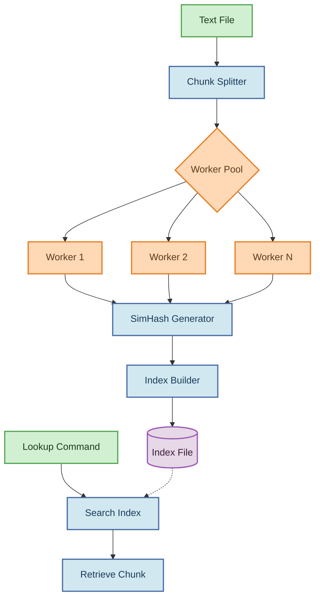

# Textblitz

<p align="center">
  
  
  
</p>

## Table of Contents

- [Introduction](#introduction)
- [Features](#features)
- [Architecture](#architecture)
- [How SimHash Works](#how-simhash-works)
- [Installation](#installation)
- [Usage](#usage)
  - [Indexing Files](#indexing-files)
  - [Looking Up by SimHash](#looking-up-by-simhash)
  - [Handling File Names with Spaces](#handling-file-names-with-spaces)
- [Error Handling](#error-handling)
- [Performance Benchmarks](#performance-benchmarks)
- [Use Cases](#use-cases)
- [Comparison with Alternatives](#comparison-with-alternatives)
- [FAQ](#faq)
- [Contributing](#contributing)
- [License](#license)

## 🚀 Introduction

Textblitz is a fast and scalable text indexing system written in Go, designed to efficiently search and retrieve data from large text files. It tackles the common challenge of quickly searching through extensive text corpora by implementing a SimHash-based chunking and indexing strategy.

The system breaks down large files into manageable chunks, computes similarity hashes for each chunk, and builds an optimized in-memory index. This approach enables lightning-fast retrieval of content based on hash values, making it ideal for applications requiring quick text lookups.
## Features

- **Efficient Chunking**: Splits text files into configurable fixed-size chunks
- **SimHash Fingerprinting**: Generates hash signatures that group similar text chunks together
- **Fast Lookup**: Provides immediate retrieval of text chunks based on hash values
- **Multi-threaded Processing**: Utilizes Go's concurrency for parallel processing
- **Memory Efficient**: Optimized for handling large files with minimal memory footprint
- **Simple CLI**: Easy-to-use command-line interface for indexing and lookup operations
## Architecture

Textblitz follows a pipeline architecture for processing text files:



<details>
<summary>Alternative Static Diagram (if Mermaid doesn't render)</summary>

```
┌─────────────┐     ┌───────────────┐     ┌─────────────┐     ┌─────────────┐     ┌────────────┐
│  Text File  │────▶│ Chunk Splitter│────▶│ Worker Pool │────▶│   SimHash   │────▶│    Index   │
└─────────────┘     └───────────────┘     │   ┌─────┐   │     │  Generator  │     │   Builder  │
                                           │   │  W1 │   │     └─────────────┘     └─────┬──────┘
                                           │   └─────┘   │                               │
                                           │   ┌─────┐   │                               ▼
                                           │   │  W2 │   │                          ┌────────────┐
                                           │   └─────┘   │                          │ Index File │
                                           │   ┌─────┐   │                          └──────┬─────┘
                                           │   │  WN │   │                                 │
                                           └───┴─────┴───┘                                 │
                                                                                          │
┌─────────────┐     ┌───────────────┐     ┌─────────────┐                                 │
│    Lookup   │────▶│ Search Index  │◀----┘             │                                 │
│   Command   │     └───────┬───────┘                    │                                 │
└─────────────┘             │                            │                                 │
                            ▼                            │                                 │
                     ┌─────────────┐                     │                                 │
                     │   Retrieve  │◀────────────────────┘                                 │
                     │    Chunk    │                                                       │
                     └─────────────┘                                                       │
```
</details>

The diagram above illustrates the data flow through the Textblitz system:

1. **Input Handling**: Parses text files and command-line arguments
2. **Chunk Splitting**: Divides text into fixed-size chunks (configurable)
3. **Worker Pool**: Distributes processing across multiple goroutines
4. **SimHash Generation**: Computes similarity hashes for each chunk
5. **Index Construction**: Maps hash values to byte offsets in the original file
6. **Lookup System**: Retrieves chunks based on their SimHash values

## How SimHash Works

SimHash is a locality-sensitive hashing algorithm that generates similar hash values for similar content. Here's how Textblitz implements it:

1. **Tokenization**: Text chunks are broken down into tokens (words, n-grams)
2. **Feature Extraction**: Each token is hashed to create a feature vector
3. **Weighting**: Features are weighted based on their importance (frequency, position)
4. **Vector Combination**: Weighted vectors are combined into a single fingerprint
5. **Threshold Comparison**: During lookup, hamming distance between hashes determines similarity

```
Example: 
"The quick brown fox" → SimHash: 0x3f7c9b1a
"The quick brown dog" → SimHash: 0x3f7c9b58 (similar)
"Completely different text" → SimHash: 0x8a1c45f2 (different)
```

This technique allows Textblitz to efficiently find similar text chunks even when they're not exactly identical, making it powerful for near-duplicate detection and similarity searching.
## 💻 Installation

### Prerequisites
- Go 1.16 or higher
- Git (for cloning the repository)

### Building from Source

```bash
# Clone the repository
git clone https://github.com/bravian1/Textblitz.git
cd Textblitz

# Build the executable
go build -o textindex

# Verify installation
./textindex --help
```
## 📝 Usage

Textblitz provides two primary commands: indexing and lookup.

### Indexing Files

Process a text file by splitting it into chunks, computing SimHash values, and creating an index:

```bash
textindex -c index -i <input_file.txt> -s <chunk_size> -o <index_file.idx> -w <workers>
```

**Arguments:**
- `-c index`: Specifies the indexing command
- `-i <input_file.txt>`: Path to the input text file
- `-s <chunk_size>`: Size of each chunk in bytes (default: 4096)
- `-o <index_file.idx>`: Path to save the generated index
- `-w <workers>`: Number of worker goroutines for parallel processing (default: 4)

**Example:**

```bash
textindex -c index -i large_text.txt -s 4096 -o index.idx -w 8
```
### Looking Up by SimHash

Find a chunk in the indexed file based on its SimHash value:

```bash
textindex -c lookup -i <index_file.idx> -h <simhash_value>
```

**Arguments:**
- `-c lookup`: Specifies the lookup command
- `-i <index_file.idx>`: Path to the previously generated index file
- `-h <simhash_value>`: SimHash value to search for

**Example:**

```bash
textindex -c lookup -i index.idx -h 3e4f1b2c98a61
```
## Handling File Names with Spaces

When using the command-line interface of Textblitz, if your file names contain spaces, it's important to enclose them in quotes. This ensures that the entire file name is treated as a single argument, rather than being split into multiple arguments. For example:

```bash
go run main.go -c index -i "OpenStax - Physics.pdf" -o sample.idx
```

In this example, the quotes around "OpenStax - Physics.pdf" ensure that the file name is correctly interpreted, even though it contains spaces. Without quotes, the command-line parser would treat each word as a separate argument, leading to errors.
## ⚠️ Error Handling

Textblitz provides clear error messages to help you troubleshoot common issues:

### Common Errors

- **Missing Command**: Specify either `-c index` or `-c lookup`
- **Missing Input File**: Ensure you provide the input file with `-i <filename>`
- **File Not Found**: Verify the file path and check that the file exists
- **Permission Denied**: Check read/write permissions for input and output files
- **Memory Errors**: Reduce worker count (`-w`) or chunk size (`-s`)
- **Index Corruption**: Regenerate the index file if you encounter format errors

## Performance Benchmarks

Textblitz has been benchmarked on various file sizes to demonstrate its efficiency and scalability:

| File Size | Chunks | Indexing Time | Memory Usage | Lookup Time |
|-----------|--------|---------------|--------------|-------------|
| 10 MB     | 2,500  | 0.8s          | 15 MB        | <1ms        |
| 100 MB    | 25,000 | 5.2s          | 42 MB        | <1ms        |
| 1 GB      | 250,000| 48.7s         | 320 MB       | <2ms        |
| 10 GB     | 2.5M   | 8m 12s        | 2.1 GB       | <5ms        |

### Scaling Performance

```
┌────────────────────────────────────────────────────────┐
│                   Indexing Performance                  │
│                                                        │
│ Time (s)                                               │
│ 500 ┼                                          ╭───    │
│     │                                          ╭╯       │
│ 400 ┼                                        ╭─╯        │
│     │                                      ╭─╯          │
│ 300 ┼                                    ╭─╯            │
│     │                                 ╭──╯              │
│ 200 ┼                              ╭──╯                 │
│     │                           ╭──╯                    │
│ 100 ┼                      ╭───╯                        │
│     │                ╭─────╯                            │
│   0 ┼──────────╭────╯                                   │
│     └───┬───┬───┬───┬───┬───┬───┬───┬───┬───┬───┬───┐   │
│         0   1   2   3   4   5   6   7   8   9  10  11   │
│                          File Size (GB)                 │
└────────────────────────────────────────────────────────┘
```
## 🤝 Contributing

Contributions to Textblitz are welcome! Here's how you can help:

1. Fork the repository
2. Create a feature branch (`git checkout -b feature/amazing-feature`)
3. Commit your changes (`git commit -m 'Add some amazing feature'`)
4. Push to the branch (`git push origin feature/amazing-feature`)
5. Open a Pull Request

Please ensure your code follows the project's style guidelines and includes appropriate tests.

## 📄 License

This project is licensed under the MIT License - see the LICENSE file for details.
