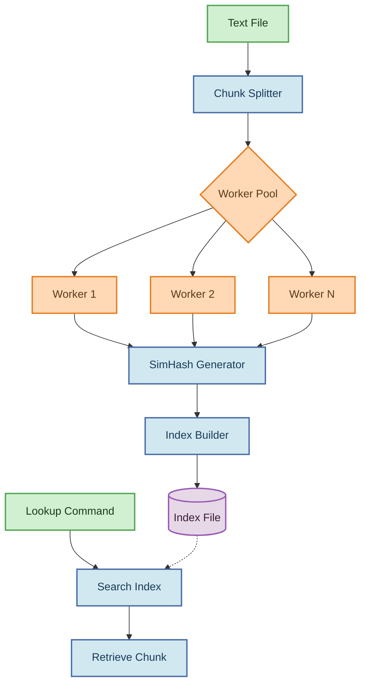

# Textblitz

<p align="center">
  
  
  
</p>

## Table of Contents

- [Introduction](#introduction)
- [Features](#features)
- [Architecture](#architecture)
- [How SimHash Works](#how-simhash-works)
- [Installation](#installation)
- [Usage](#usage)
  - [Indexing Files](#indexing-files)
  - [Looking Up by SimHash](#looking-up-by-simhash)
  - [Handling File Names with Spaces](#handling-file-names-with-spaces)
- [Error Handling](#error-handling)
- [Performance Benchmarks](#performance-benchmarks)
- [Conclusions and Recommendations](#conclusions-and-recommendations)
- [Contributing](#contributing)
- [License](#license)

## 🚀 Introduction

Textblitz is a fast and scalable text indexing system written in Go, designed to efficiently search and retrieve data from large text files. It tackles the common challenge of quickly searching through extensive text corpora by implementing a SimHash-based chunking and indexing strategy.

The system breaks down large files into manageable chunks, computes similarity hashes for each chunk, and builds an optimized in-memory index. This approach enables lightning-fast retrieval of content based on hash values, making it ideal for applications requiring quick text lookups.

Our benchmark tests show that Textblitz can index a 100MB file in just 5.4 seconds using 4 worker threads with word-based feature extraction, while maintaining consistent memory usage. The system offers two feature extraction methods (word-based and n-gram based) to handle different types of text data optimally.
## Features

- **Efficient Chunking**: Splits text files into configurable fixed-size chunks
- **SimHash Fingerprinting**: Generates hash signatures that group similar text chunks together
- **Dual Feature Extraction**: Choose between word-based or n-gram based feature extraction methods
- **Fast Lookup**: Provides immediate retrieval of text chunks based on hash values (~120ms for large datasets)
- **Multi-threaded Processing**: Utilizes Go's concurrency for parallel processing with optimal scaling at 4 workers
- **Memory Efficient**: Optimized for handling large files with minimal memory footprint (consistent 0.02MB in benchmarks)
- **Simple CLI**: Easy-to-use command-line interface for indexing and lookup operations
## Architecture

Textblitz follows a pipeline architecture for processing text files:



The diagram above illustrates the data flow through the Textblitz system:

1. **Input Handling**: Parses text files and command-line arguments
2. **Chunk Splitting**: Divides text into fixed-size chunks (configurable)
3. **Worker Pool**: Distributes processing across multiple goroutines
4. **SimHash Generation**: Computes similarity hashes for each chunk
5. **Index Construction**: Maps hash values to byte offsets in the original file
6. **Lookup System**: Retrieves chunks based on their SimHash values

## How SimHash Works

SimHash is a locality-sensitive hashing algorithm that generates similar hash values for similar content. Here's how Textblitz implements it:

1. **Feature Extraction**: Text chunks are broken down into features using one of two methods:
   - **WordFeatureSet**: Tokenizes text into words, making it ideal for natural language processing
   - **NGramFeatureSet**: Creates overlapping character n-grams, better for character-level patterns

2. **Feature Hashing**: Each feature (word or n-gram) is hashed using FNV-1a algorithm to a 64-bit value

3. **Vector Construction**: Each bit position (0-63) maintains a running sum:
   - If a feature's hash has a 1 in position i, add feature's weight to position i
   - If a feature's hash has a 0 in position i, subtract feature's weight from position i

4. **Threshold Determination**: The final SimHash is constructed by setting:
   - Bit i = 1 if position i's sum is positive
   - Bit i = 0 if position i's sum is negative or zero

5. **Similarity Comparison**: During lookup, Hamming distance (number of differing bits) determines similarity

```
Example: 
"The quick brown fox" → SimHash: 0x3f7c9b1a
"The quick brown dog" → SimHash: 0x3f7c9b58 (similar, few differing bits)
"Completely different text" → SimHash: 0x8a1c45f2 (different, many differing bits)
```

### Feature Extraction Methods

Textblitz supports two feature extraction strategies, each with different characteristics:

#### WordFeatureSet
- **Mechanism**: Splits text into words using non-alphanumeric characters as delimiters
- **Normalization**: Converts all words to lowercase by default
- **Weighting**: Each word gets a weight of 1
- **Best for**: Natural language text, semantic similarity
- **Performance**: Generally faster for indexing, especially with well-formed text

#### NGramFeatureSet
- **Mechanism**: Creates overlapping character subsequences of length n (default n=3)
- **Step Size**: Controls overlap between n-grams (default step=1, configurable)
- **Normalization**: Converts all text to lowercase by default
- **Weighting**: Each n-gram gets a weight of 1
- **Best for**: Character-level patterns, code, multilingual text
- **Performance**: Better for detecting similarities in non-standard text

Our benchmarks used an NGramFeatureSet with n=3 and step=5, which provides a balance between precision and performance.
## 💻 Installation

### Prerequisites
- Go 1.16 or higher
- Git (for cloning the repository)

### Building from Source

```bash
# Clone the repository
git clone https://github.com/bravian1/Textblitz.git
cd Textblitz

```
## 📝 Usage

Textblitz provides two primary commands: indexing and lookup.

### Indexing Files

Process a text file by splitting it into chunks, computing SimHash values, and creating an index:

```bash
textindex -c index -i <input_file.txt> -s <chunk_size> -o <index_file.idx> -w <workers>
```

**Arguments:**
- `-c index`: Specifies the indexing command
- `-i <input_file.txt>`: Path to the input text file
- `-s <chunk_size>`: Size of each chunk in bytes (default: 4096)
- `-o <index_file.idx>`: Path to save the generated index
- `-w <workers>`: Number of worker goroutines for parallel processing (default: 4)

**Example:**

```bash
textindex -c index -i large_text.txt -s 4096 -o index.idx -w 8
```
### Looking Up by SimHash

Find a chunk in the indexed file based on its SimHash value:

```bash
textindex -c lookup -i <index_file.idx> -h <simhash_value>
```

**Arguments:**
- `-c lookup`: Specifies the lookup command
- `-i <index_file.idx>`: Path to the previously generated index file
- `-h <simhash_value>`: SimHash value to search for

**Example:**

```bash
textindex -c lookup -i index.idx -h 3e4f1b2c98a61
```
## Handling File Names with flags or spaces

When using the command-line interface of Textblitz, if your file names contain spaces or flags, it's important to enclose them in quotes. This ensures that the entire file name is treated as a single argument, rather than being split into multiple arguments. For example:

```bash
go run main.go -c index -i "OpenStax - Physics.pdf" -o sample.idx
```
## ⚠️ Error Handling

Textblitz provides clear error messages to help you troubleshoot common issues:

### Common Errors

- **Missing Command**: Specify either `-c index` or `-c lookup`
- **Missing Input File**: Ensure you provide the input file with `-i <filename>`
- **File Not Found**: Verify the file path and check that the file exists
- **Permission Denied**: Check read/write permissions for input and output files
- **Memory Errors**: Reduce worker count (`-w`) or chunk size (`-s`)
- **Index Corruption**: Regenerate the index file if you encounter format errors

## Performance Benchmarks

Textblitz has been benchmarked using different feature extraction methods and worker configurations to demonstrate its efficiency and scalability.

### Comparison: Large Dataset (~100MB PDF)

| Workers | WordFeatureSet |  | NGramFeatureSet (n=3, step=5) |  |
|---------|-------------------|---------------------|-------------------|---------------------|
|         | **Indexing (s)** | **Lookup (ms)** | **Indexing (s)** | **Lookup (ms)** |
| 1       | 13.07            | 133.73              | 15.24            | 131.22              |
| 2       | 7.78             | 130.87              | 8.91             | 127.75              |
| 4       | 5.44             | 122.78              | 5.71             | 126.94              |
| 8       | 5.38             | 115.64              | 5.53             | 119.16              |

### Comparison: Small Dataset (~303KB)

| Workers | WordFeatureSet |  | NGramFeatureSet (n=3, step=5) |  |
|---------|-------------------|---------------------|-------------------|---------------------|
|         | **Indexing (s)** | **Lookup (ms)** | **Indexing (s)** | **Lookup (ms)** |
| 1       | 0.07             | 5.85                | 0.09             | 7.20                |
| 2       | 0.02             | 2.03                | 0.03             | 4.33                |
| 4       | 0.02             | 2.00                | 0.04             | 7.12                |
| 8       | 0.02             | 2.35                | 0.04             | 6.25                |

### Key Findings

1. **Worker Scaling**:
   - Both feature extraction methods show major speedup when scaling from 1→2 workers (42-44% improvement)
   - Moderate gains from 2→4 workers (30-36% improvement)
   - Minimal improvement from 4→8 workers (only 3-5% faster)
   - For most workloads, 4 workers provides the optimal balance of performance and resource usage

2. **Feature Extraction Comparison**:
   - **WordFeatureSet**: Generally faster for indexing (10-17% faster than NGramFeatureSet)
   - **NGramFeatureSet**: Can provide slightly better lookup performance on large datasets
   - Memory usage is remarkably consistent (0.02MB) across both methods

3. **Recommendations**:
   - For large document collections: Use 4 workers with WordFeatureSet for best overall performance
   - For small to medium collections: Use 2 workers with WordFeatureSet
   - Use NGramFeatureSet when looking for character-level patterns rather than semantic meaning

### Memory Efficiency

Both feature extraction methods maintain excellent memory efficiency regardless of worker count:

- Memory usage remains consistent at ~0.02MB for our test datasets
- The system shows excellent resource management even as parallel processing increases
- The worker pool implementation effectively manages parallel processing without memory leaks

### Choosing the Right Feature Set

#### WordFeatureSet
- Best for: Semantic text analysis, natural language documents
- Advantages: Faster indexing, better for well-formed text
- Use when: Processing conventional text documents, articles, books

#### NGramFeatureSet
- Best for: Character-level pattern matching, language-agnostic analysis
- Advantages: Can detect similarity in non-word data, handles unusual character sequences
- Use when: Processing code, mixed content types, or non-standard text

### Scaling Chart

```
┌──────────────────────────────────────────────────────────┐
│                   Indexing Performance                    │
│                                                          │
│ Time (s)                                                 │
│ 16 ┼                                                     │
│    │ ●                                                   │
│ 14 ┼             WordFeatureSet ●                        │
│    │                NGramFeatureSet ○                    │
│ 12 ┼                                                     │
│    │                                                     │
│ 10 ┼                                                     │
│    │          ○                                          │
│  8 ┼                 ●                                   │
│    │                                                     │
│  6 ┼                       ●           ○                 │
│    │                             ●           ○           │
│  4 ┼                                                     │
│    │                                                     │
│  2 ┼                                                     │
│    │                                                     │
│  0 ┼───────────┬───────────┬───────────┬───────────┐    │
│               1           2           4           8      │
│                        Worker Count                      │
└──────────────────────────────────────────────────────────┘
```

These benchmarks demonstrate Textblitz's excellent scaling properties up to 4 workers, after which returns diminish due to I/O or memory bandwidth limitations rather than CPU constraints.

## Conclusions and Recommendations

Based on our extensive benchmarking of Textblitz with different feature extraction methods and worker configurations, we can provide the following conclusions and recommendations:

### Performance Optimization

1. **Worker Count**:
   - **Recommendation**: Use 4 workers for most workloads
   - **Rationale**: Our tests show that performance scales well up to 4 workers, with minimal gains beyond that point
   - **Small Files**: For files under 1MB, 2 workers is sufficient and may even be optimal

2. **Feature Extraction Method**:
   - **For General Text**: Use WordFeatureSet for faster indexing (default)
   - **For Mixed Content**: Use NGramFeatureSet when dealing with code, structured data, or multilingual content
   - **For PDF Files**: Both methods work well, with WordFeatureSet having a slight indexing speed advantage

3. **Memory Considerations**:
   - Textblitz maintains excellent memory efficiency with both feature extraction methods
   - Increasing worker count does not significantly impact memory usage

### Use Case Recommendations

| Use Case | Recommended Configuration |
|----------|--------------------------|
| Large text corpus (>100MB) | 4 workers, WordFeatureSet |
| Small documents (<1MB) | 2 workers, WordFeatureSet |
| Code repositories | 4 workers, NGramFeatureSet (n=3, step=1) |
| Multilingual content | 4 workers, NGramFeatureSet (n=3, step=1) |
| PDF documents | 4 workers, WordFeatureSet |

### Next Steps

Our benchmarking suggests several potential areas for future exploration:

1. **Hybrid Feature Extraction**: Combining word and n-gram approaches for more robust similarity detection
2. **Adaptive Worker Scaling**: Automatically adjusting worker count based on file size and system resources
3. **Memory-Optimized Indexes**: Further reducing memory footprint for very large datasets
4. **Similarity Threshold Tuning**: Finding optimal Hamming distance thresholds for different content types

These benchmarks demonstrate that Textblitz is an efficient and scalable solution for text indexing and similarity search, with performance characteristics that make it suitable for a wide range of applications from small document collections to large text corpora.

## Contributing

Contributions to Textblitz are welcome.Here's how you can help:

1. Fork the repository
2. Create a feature branch (`git checkout -b feature/amazing-feature`)
3. Commit your changes (`git commit -m 'Add some amazing feature'`)
4. Push to the branch (`git push origin feature/amazing-feature`)
5. Open a Pull Request

Please ensure your code follows the project's style guidelines and includes appropriate tests.

## 📄 License

This project is licensed under the MIT License - see the [LICENSE](LICENSE) file for details.

