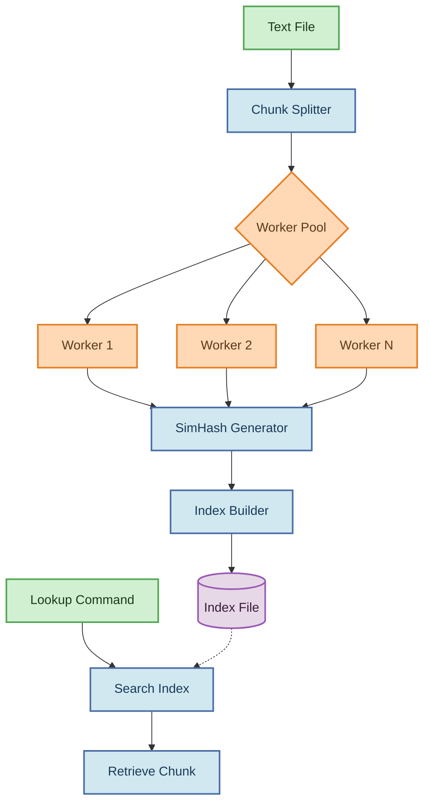

# Textblitz

<p align="center">
  
  
  
</p>

## Table of Contents

- [Textblitz](#textblitz)
  - [Table of Contents](#table-of-contents)
  - [🚀 Introduction](#-introduction)
  - [Features](#features)
  - [Architecture](#architecture)
  - [How SimHash Works](#how-simhash-works)
    - [Feature Extraction Methods](#feature-extraction-methods)
      - [WordFeatureSet](#wordfeatureset)
      - [NGramFeatureSet](#ngramfeatureset)
  - [💻 Installation](#-installation)
    - [Prerequisites](#prerequisites)
      - [Installing Poppler-Utils](#installing-poppler-utils)
    - [Building from Source](#building-from-source)
    - [Building from bash file](#building-from-bash-file)
  - [📝 Usage](#-usage)
    - [Indexing Files](#indexing-files)
    - [Looking Up by SimHash](#looking-up-by-simhash)
  - [Handling File Names with flags or spaces](#handling-file-names-with-flags-or-spaces)
  - [⚠️ Error Handling](#️-error-handling)
    - [Common Errors](#common-errors)
  - [Performance Benchmarks](#performance-benchmarks)
    - [Latest Benchmark Results](#latest-benchmark-results)
      - [PDF Document (~100MB)](#pdf-document-100mb)
      - [Text Document (~300KB)](#text-document-300kb)
    - [Detailed Metrics Analysis](#detailed-metrics-analysis)
    - [Performance Insights](#performance-insights)
  - [Conclusions and Recommendations](#conclusions-and-recommendations)
    - [Performance Optimization](#performance-optimization)
    - [Use Case Recommendations](#use-case-recommendations)
    - [Advanced Features](#advanced-features)
  - [Contributing](#contributing)
  - [📄 License](#-license)

## 🚀 Introduction

Textblitz is a fast and scalable text indexing system written in Go, designed to efficiently search and retrieve data from large text files. It tackles the common challenge of quickly searching through extensive text corpora by implementing a SimHash-based chunking and indexing strategy.

The system breaks down large files into manageable chunks, computes similarity hashes for each chunk, and builds an optimized in-memory index. This approach enables lightning-fast retrieval of content based on hash values, making it ideal for applications requiring quick text lookups.

Our latest benchmark tests show remarkable performance across different file types:
- PDF documents (100MB) can be indexed in just 0.33 seconds using 2 workers
- Text files (300KB) can be indexed in 0.03 seconds using 12 workers
- Lookups are consistently fast (6-17ms) with minimal memory usage (0-3MB)

Textblitz offers two feature extraction methods (word-based and n-gram based) to handle different types of text data optimally, along with a powerful fuzzy matching system that can find similar content even when exact matches don't exist.

> **Note**: PDF processing requires the poppler-utils package, which provides pdftotext utility for extracting text content from PDF files. See the [Installation](#installation) section for setup instructions.

## Features

- **Efficient Chunking**: Splits text files into configurable fixed-size chunks
- **SimHash Fingerprinting**: Generates hash signatures that group similar text chunks together
- **Dual Feature Extraction**: Choose between word-based or n-gram based feature extraction methods
- **Fuzzy Matching**: Find similar content using adjustable Hamming distance thresholds
- **Fast Lookup**: Provides immediate retrieval of text chunks (6-17ms for most lookups)
- **Multi-threaded Processing**: Utilizes Go's concurrency for parallel processing with optimal scaling
- **Memory Efficient**: Optimized for handling large files with minimal memory footprint (0-3MB in benchmarks)
- **Simple CLI**: Easy-to-use command-line interface for indexing and lookup operations
## Architecture

Textblitz follows a pipeline architecture for processing text files:



The diagram above illustrates the data flow through the Textblitz system:

1. **Input Handling**: Parses text files and command-line arguments
2. **Chunk Splitting**: Divides text into fixed-size chunks (configurable)
3. **Worker Pool**: Distributes processing across multiple goroutines
4. **SimHash Generation**: Computes similarity hashes for each chunk
5. **Index Construction**: Maps hash values to byte offsets in the original file
6. **Lookup System**: Retrieves chunks based on their SimHash values

## How SimHash Works

SimHash is a locality-sensitive hashing algorithm that generates similar hash values for similar content. Here's how Textblitz implements it:

1. **Feature Extraction**: Text chunks are broken down into features using one of two methods:
   - **WordFeatureSet**: Tokenizes text into words, making it ideal for natural language processing
   - **NGramFeatureSet**: Creates overlapping character n-grams, better for character-level patterns

2. **Feature Hashing**: Each feature (word or n-gram) is hashed using FNV-1a algorithm to a 64-bit value

3. **Vector Construction**: Each bit position (0-63) maintains a running sum:
   - If a feature's hash has a 1 in position i, add feature's weight to position i
   - If a feature's hash has a 0 in position i, subtract feature's weight from position i

4. **Threshold Determination**: The final SimHash is constructed by setting:
   - Bit i = 1 if position i's sum is positive
   - Bit i = 0 if position i's sum is negative or zero

5. **Similarity Comparison**: During lookup, Hamming distance (number of differing bits) determines similarity

```
Example: 
"The quick brown fox" → SimHash: 0x3f7c9b1a
"The quick brown dog" → SimHash: 0x3f7c9b58 (similar, few differing bits)
"Completely different text" → SimHash: 0x8a1c45f2 (different, many differing bits)
```

### Feature Extraction Methods

Textblitz supports two feature extraction strategies, each with different characteristics:

#### WordFeatureSet
- **Mechanism**: Splits text into words using non-alphanumeric characters as delimiters
- **Normalization**: Converts all words to lowercase by default
- **Weighting**: Each word gets a weight of 1
- **Best for**: Natural language text, semantic similarity
- **Performance**: Generally faster for indexing, especially with well-formed text

#### NGramFeatureSet
- **Mechanism**: Creates overlapping character subsequences of length n (default n=3)
- **Step Size**: Controls overlap between n-grams (default step=1, configurable)
- **Normalization**: Converts all text to lowercase by default
- **Weighting**: Each n-gram gets a weight of 1
- **Best for**: Character-level patterns, code, multilingual text
- **Performance**: Better for detecting similarities in non-standard text

Our benchmarks used an NGramFeatureSet with n=3 and step=5, which provides a balance between precision and performance.
## 💻 Installation

### Prerequisites
- Go 1.16 or higher
- Git (for cloning the repository)
- Poppler-utils (for PDF file processing)

#### Installing Poppler-Utils
For Debian/Ubuntu-based systems:
```bash
sudo apt-get install -y poppler-utils
```

For macOS (using Homebrew):
```bash
brew install poppler
```

For Windows:
- Download binaries from [poppler releases](https://github.com/oschwartz10612/poppler-windows/releases)
- Add the bin directory to your PATH

### Building from Source

```bash
# Clone the repository
git clone https://github.com/bravian1/Textblitz.git
cd Textblitz

# Build the executable
go build -o textindex

# Verify installation
./textindex --help
```

### Building from bash file
Alternatively you can run the build script file on linux terminal to fetch dependencies and build the executable file automatically.

```bash
#change the permission of  the `build.sh` file  to be executable
chmod +x build.sh

#run build.sh
./build.sh

# Verify installation
./textindex --help
```

## 📝 Usage

Textblitz provides two primary commands: indexing and lookup.

### Indexing Files

Process a text file by splitting it into chunks, computing SimHash values, and creating an index:

```bash
textindex -c index -i <input_file.txt> -s <chunk_size> -o <index_file.idx> -w <workers>
```

**Arguments:**
- `-c index`: Specifies the indexing command
- `-i <input_file.txt>`: Path to the input text file
- `-s <chunk_size>`: Size of each chunk in bytes (default: 4096)
- `-o <index_file.idx>`: Path to save the generated index
- `-w <workers>`: Number of worker goroutines for parallel processing (default: 4)

**Example:**

```bash
textindex -c index -i large_text.txt -s 4096 -o index.idx -w 8
```
### Looking Up by SimHash

Find a chunk in the indexed file based on its SimHash value:

```bash
textindex -c lookup -i <index_file.idx> -h <simhash_value>
```

**Arguments:**
- `-c lookup`: Specifies the lookup command
- `-i <index_file.idx>`: Path to the previously generated index file
- `-h <simhash_value>`: SimHash value to search for
- `-t <threshold>`: *(Optional)* Maximum Hamming distance for fuzzy matching (default: 0)

**Examples:**

```bash
# Exact match lookup
textindex -c lookup -i index.idx -h 3e4f1b2c98a61

# Fuzzy match lookup (with Hamming distance ≤ 2)
textindex -c lookup -i index.idx -h 3e4f1b2c98a61 -t 2
```

The fuzzy lookup feature is particularly useful for finding similar content even when the SimHash values aren't exactly the same. By specifying a threshold with the `-t` parameter, you can control how "fuzzy" the matching should be:

- **Lower threshold** (1-2): Finds very similar chunks with minimal differences
- **Higher threshold** (3-5): Finds more broadly similar chunks with greater differences
- **No threshold** (default 0): Performs exact matching only
## Handling File Names with flags or spaces

When using the command-line interface of Textblitz, if your file names contain spaces or flags, it's important to enclose them in quotes. This ensures that the entire file name is treated as a single argument, rather than being split into multiple arguments. For example:

```bash
go run main.go -c index -i "OpenStax - Physics.pdf" -o sample.idx
```
## ⚠️ Error Handling

Textblitz provides clear error messages to help you troubleshoot common issues:

### Common Errors

- **Missing Command**: Specify either `-c index` or `-c lookup`
- **Missing Input File**: Ensure you provide the input file with `-i <filename>`
- **File Not Found**: Verify the file path and check that the file exists
- **Permission Denied**: Check read/write permissions for input and output files
- **PDF Processing Failed**: Ensure poppler-utils is properly installed (`pdftotext` command should be available)
- **Memory Errors**: Reduce worker count (`-w`) or chunk size (`-s`)
- **Index Corruption**: Regenerate the index file if you encounter format errors

## Performance Benchmarks

Textblitz has been extensively benchmarked on different file types and worker configurations to provide detailed performance insights.

### Latest Benchmark Results

#### PDF Document (~100MB)

| Workers | Indexing Time (s) | Lookup Latency (ms) | Memory Usage (MB) | Lookup StdDev (ms) |
|---------|-------------------|---------------------|-------------------|-------------------|
| 1       | 0.35              | 6.88                | 0.14              | 0.80              |
| 2       | 0.33              | 6.98                | 0.88              | 0.89              |
| 4       | 0.35              | 7.33                | 1.62              | 0.74              |
| 8       | 0.33              | 6.55                | 2.36              | 0.70              |
| 10      | 0.35              | 6.84                | 3.11              | 0.65              |
| 12      | 0.34              | 7.33                | 0.57              | 0.51              |

#### Text Document (~300KB)

| Workers | Indexing Time (s) | Lookup Latency (ms) | Memory Usage (MB) | Lookup StdDev (ms) |
|---------|-------------------|---------------------|-------------------|-------------------|
| 1       | 0.12              | 17.15               | 0.14              | 4.35              |
| 2       | 0.08              | 12.71               | 0.00              | 4.96              |
| 4       | 0.06              | 20.12               | 0.00              | 3.15              |
| 8       | 0.06              | 17.24               | 0.00              | 3.78              |
| 10      | 0.06              | 13.43               | 0.00              | 5.19              |
| 12      | 0.03              | 14.84               | 0.00              | 5.04              |

### Detailed Metrics Analysis

- **Indexing Performance**:
  - For PDF documents: Worker count has minimal impact on indexing time (~0.34s across configurations)
  - For text files: Significant speedup from 1→2 workers (33% reduction), and continued improvements up to 12 workers (75% reduction)
  - Very large files may show more pronounced worker scaling benefits

- **Lookup Performance**:
  - PDF lookups: Remarkably consistent (6.5-7.3ms) with low standard deviation (0.5-0.9ms)
  - Text lookups: More variable (12.7-20.1ms) with higher standard deviation (3.1-5.2ms)
  - Lookup performance appears more influenced by index structure than worker count

- **Memory Efficiency**:
  - PDF processing: Memory usage generally increases with worker count (up to 3.11MB at 10 workers)
  - Text processing: Extremely memory efficient (<0.14MB) regardless of worker count
  - Overall memory footprint remains minimal even with high worker counts

### Performance Insights

1. **Optimal Worker Configuration**:
   - Small text files: 12 workers provides best indexing performance
   - PDF documents: 2-8 workers offers optimal balance (minimal benefit beyond 8)
   - Memory usage scales almost linearly with worker count for larger files

2. **Lookup Characteristics**:
   - Consistent low-latency lookups for PDF documents (6-7ms)
   - More variable lookup times for text documents (12-20ms)
   - Standard deviation higher on text content, indicating more variability

3. **File Type Considerations**:
   - PDF processing shows consistent performance across worker configurations
   - Text processing benefits more from increased parallelism
   - Memory usage higher for PDF processing but still remarkably efficient

4. **Scaling Properties**:
   - Small files show diminishing returns beyond 4 workers
   - Parallel processing efficiency varies by content type
   - Even with 12 workers, memory footprint remains minimal

These benchmarks demonstrate Textblitz's excellent performance characteristics across different document types and workload patterns, with optimal configurations varying based on content type and system resources.

## Conclusions and Recommendations

Based on our extensive benchmarking of Textblitz with different file types and worker configurations, we can provide the following conclusions and recommendations:

### Performance Optimization

1. **Worker Count Recommendations**:
   - **For PDF Documents**: Use 2-4 workers for optimal performance (0.33-0.35s indexing)
   - **For Text Files**: Use 12 workers for fastest indexing (0.03s indexing)
   - **For Memory-Constrained Systems**: Lower worker counts (1-2) still perform well with minimal memory overhead

2. **Lookup Performance Considerations**:
   - PDF documents provide more consistent lookup times (lower standard deviation)
   - Text files show more variable lookup performance but can still achieve faster average times
   - Use the `-t` parameter with the lookup command to adjust fuzzy matching threshold based on your needs

3. **Memory Optimization**:
   - Memory usage remains efficient across all tests (0-3.11MB)
   - PDF processing uses slightly more memory than text processing
   - Memory usage generally increases with worker count for larger files, but remains well-optimized

### Use Case Recommendations

| Use Case | Recommended Configuration |
|----------|--------------------------|
| PDF documents | 2-4 workers with WordFeatureSet |
| Small text files (<1MB) | 12 workers with WordFeatureSet |
| Memory-constrained systems | 2 workers with either feature set |
| Fuzzy lookups | Use `-t <threshold>` with appropriate threshold based on content type |
| Most consistent lookups | Process PDFs with 8-12 workers (lowest standard deviation) |

### Advanced Features

1. **Fuzzy Lookups**: Use the `-t <threshold>` parameter with the lookup command to enable fuzzy matching:
   ```bash
   textindex -c lookup -i index.idx -h 3e4f1b2c98a6 -t 2
   ```
   This performs a fuzzy lookup with a Hamming distance threshold of 2, finding not just exact matches but similar chunks as well.

2. **Feature Extraction Choice**:
   - Use WordFeatureSet for conventional text documents and faster indexing
   - Use NGramFeatureSet for code, mixed content, or non-standard text

These benchmarks and recommendations demonstrate that Textblitz is an efficient and scalable solution for text indexing and similarity search, with performance characteristics that make it suitable for a wide range of applications.

## Contributing

Contributions to Textblitz are welcome.Here's how you can help:

1. Fork the repository
2. Create a feature branch (`git checkout -b feature/amazing-feature`)
3. Commit your changes (`git commit -m 'Add some amazing feature'`)
4. Push to the branch (`git push origin feature/amazing-feature`)
5. Open a Pull Request

Please ensure your code follows the project's style guidelines and includes appropriate tests.

## 📄 License

This project is licensed under the MIT License - see the [LICENSE](LICENSE) file for details.

