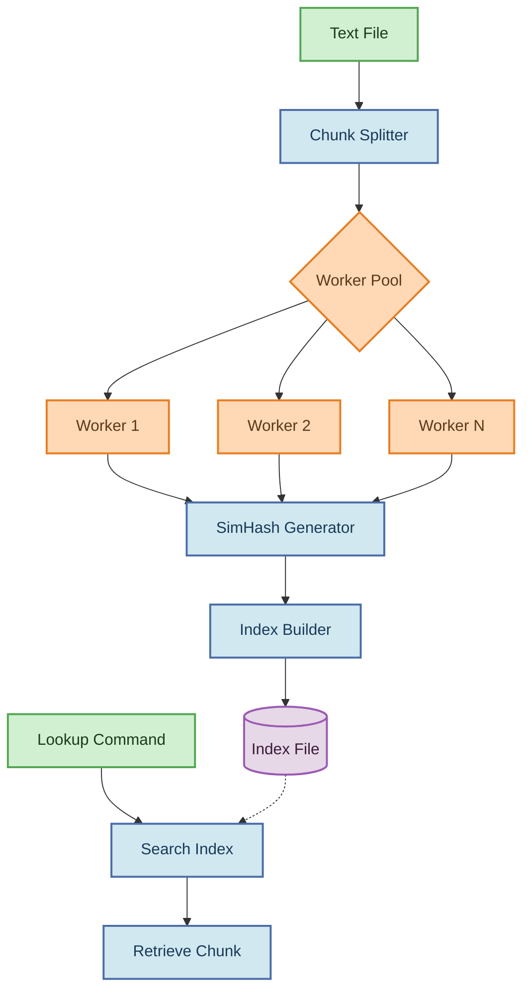

# Textblitz

  
  
  

## Table of Contents

- [Introduction](#introduction)
- [Features](#features)
- [Architecture](#architecture)
- [Installation](#installation)
- [Usage](#usage)
  - [Indexing Files](#indexing-files)
  - [Looking Up by SimHash](#looking-up-by-simhash)
  - [Handling File Names with Spaces](#handling-file-names-with-spaces)
- [Error Handling](#error-handling)
- [Performance Considerations](#performance-considerations)
- [Contributing](#contributing)
- [License](#license)

## 🚀 Introduction

Textblitz is a fast and scalable text indexing system written in Go, designed to efficiently search and retrieve data from large text files. It tackles the common challenge of quickly searching through extensive text corpora by implementing a SimHash-based chunking and indexing strategy.

The system breaks down large files into manageable chunks, computes similarity hashes for each chunk, and builds an optimized in-memory index. This approach enables lightning-fast retrieval of content based on hash values, making it ideal for applications requiring quick text lookups.
## Features

- **Efficient Chunking**: Splits text files into configurable fixed-size chunks
- **SimHash Fingerprinting**: Generates hash signatures that group similar text chunks together
- **Fast Lookup**: Provides immediate retrieval of text chunks based on hash values
- **Multi-threaded Processing**: Utilizes Go's concurrency for parallel processing
- **Memory Efficient**: Optimized for handling large files with minimal memory footprint
- **Simple CLI**: Easy-to-use command-line interface for indexing and lookup operations
##  Architecture

Textblitz follows a pipeline architecture for processing text files:

The diagram above illustrates the data flow through the Textblitz system:

1. **Input Handling**: Parses text files and command-line arguments
2. **Chunk Splitting**: Divides text into fixed-size chunks (configurable)
3. **Worker Pool**: Distributes processing across multiple goroutines
4. **SimHash Generation**: Computes similarity hashes for each chunk
5. **Index Construction**: Maps hash values to byte offsets in the original file
6. **Lookup System**: Retrieves chunks based on their SimHash values
